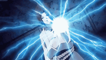

# Practica5-ciu-NarutoFinalFight
Practica 5 de CIU
# CIU - Práctica 5
# Rubén García Quintana

## Escena usando texturas con elementos 3D

Esta práctica consiste en crear una escena donde utilizamos los diferentes conceptos aprendidos anteriormente.

En mi caso, me he basado en una escena de la serie de animación japonesa Naruto, para realizar una escena similar usando las herramientas de processing.

Aqui podemos ver un gif con una pequeña demostración de su ejecución. 


### Desarrollo de la práctica

Para el desarrollo de la práctica se ha utilizado diversas imagenes sacadas de internet para usarlas como texturas, ademas de los distintos metodos que nos ofrece processing.

Por ejemplo, para el ataque del lado izquierdo, se queria conseguir un diseño similar al siguiente:



Para ello, se uso un objeto PShape 3D con forma de esfera, de la cual salian diferentes formas "LINE" 3D que se crean continuamente.


```
chidori= new PShape[31];
                  chidori[30]= createShape(SPHERE,radio);
                  chidori[30].setStroke(color(0,0,255));
                  chidori[30].setTexture(texturaC);
                  
.
.
.


beginShape();
      //se crean los "rayos" 
     for(int i =0; i <30;i++){
       stroke(59,131,189);
       chidori[i] = createShape(LINE,0,0,random(-longitudR,longitudR),random(-longitudR,longitudR));
       chidori[i].setStroke(3,color(0,0,255));
     }      
       
      endShape();
    //se muestran los "rayos"
    for(int i =0; i <30;i++){
    noStroke();
    pushMatrix();
      translate(width-100-fin,height/2,0);
      rotateY(radians(random(0,255)));
      shape(chidori[i]);
    popMatrix();
    }
    
    //se crea la esfera
    noStroke();
    pushMatrix();
      translate(width-100-fin,height/2,0);      
      rotateY(radians(200));
      shape(chidori[30]);
    popMatrix();

```

Para el otro ataque, como consiste unicamente en una esfera, pues se uso una esfera 3D y se le añadio una textura lo mas parecida posible.

```

              rasengan= createShape(SPHERE,radio);
              rasengan.setStroke(255);
              rasengan.setTexture(texturaR);
```


La ejecución consiste en crear ambos ataques usando las teclas 'R' y 'C'. Tras ello, se debe potenciar el ataque pulsando muchas veces la tecla 'A' para el ataque derecho y la tecla 'L' para el ataque izquierdo.

 - Una vez ambos ataques están cargador al máximo, se deja libertad de movimiento con la cámara para decidir desde donde ver el final de la escena. Finalmente, usando la tecla 'BACKSPACE' podemos ejecutar el movimiento final de ambos ataques chocando entre ellos y reiniciando el programa.
 
 
 ### Iluminación
  Por último, se ha añadido que usando la tecla 'ENTER', podemos cambiar el ambiente de combate dificultando la luz de la luna como si hubiera un eclipse. 
  
 
 
 -- Para la realización de la practica se ha usado como referencia el guion de prácticas de la asignatura.
